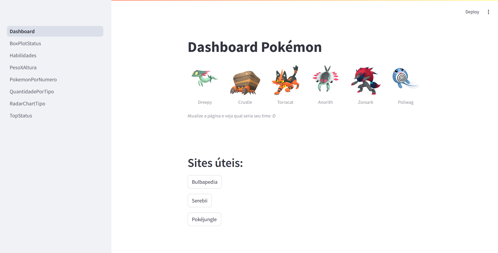
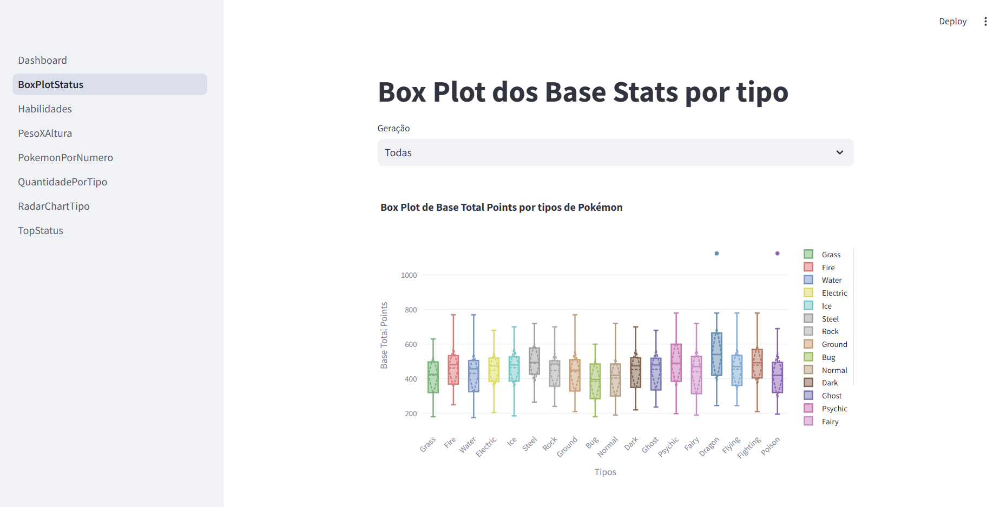
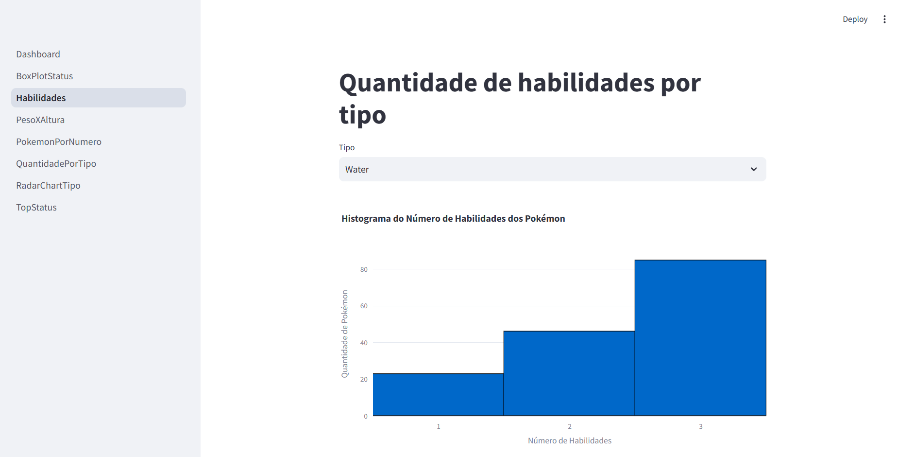
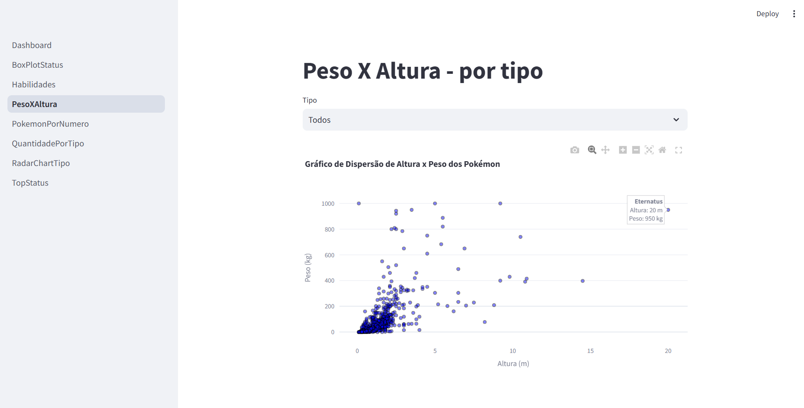
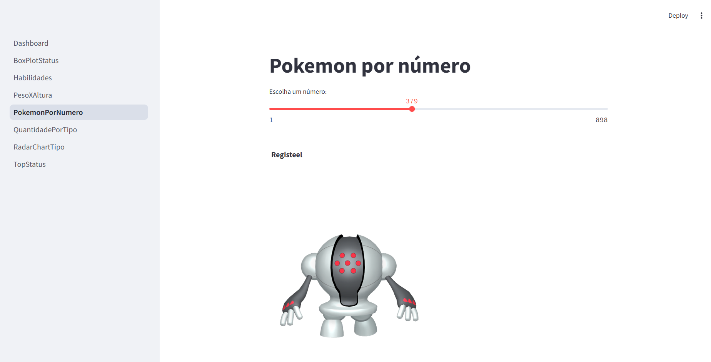
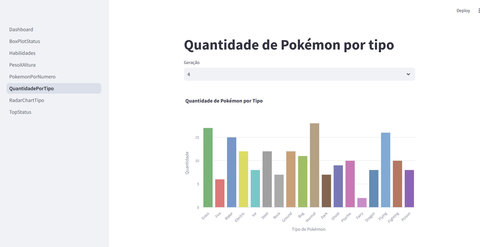
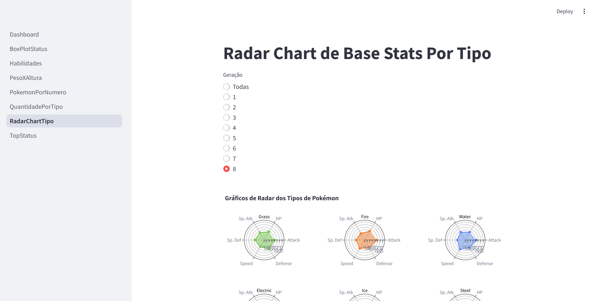
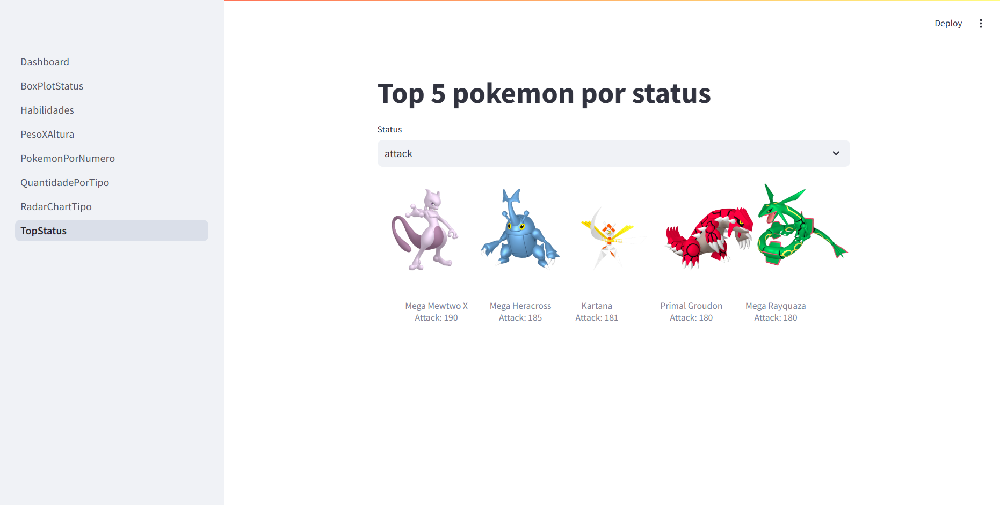

# CESAR School Dashboard

Dashboard realizado pelo aluno Bruno Felipe Soares Santos (bfss@cesar.school)

## Passo a passo para rodar venv no Windows

Passo a passo para criar virtualenv e rodar no Windows
``` 
python -m venv venv-pokemon-v2
.\venv-pokemon-v2\Scripts\activate
pip install -r requirements.txt
```

## O Dashboard conta com uma série de visualizações dos Pokémon da Primeira até a Oitava geração


Na tela inicial, encontram-se links úteis além da funcionalidade de: cada vez que abrir a página será montado um time de 8 pokémon diferentes. Tente a sorte para montar um bom time!

## Box plot dos status gerais por tipo de pokémon, com possibilidade de filtro por geração


## Quantidade de habilidades por tipo


## Relação Peso x Altura por tipo


## Escolha de Pokemon por número (barra deslizante)


## Quantidade de pokémon por tipo com filtro de geração


## Radar chart da média dos status separados por tipos


## Top Pokémon por status

